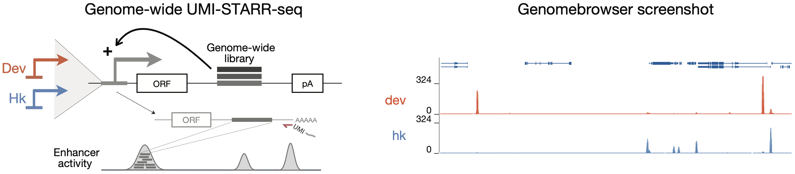
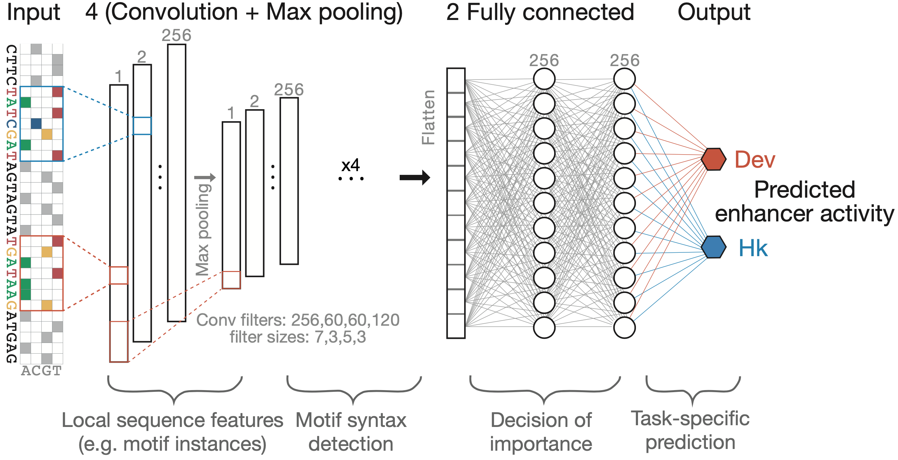
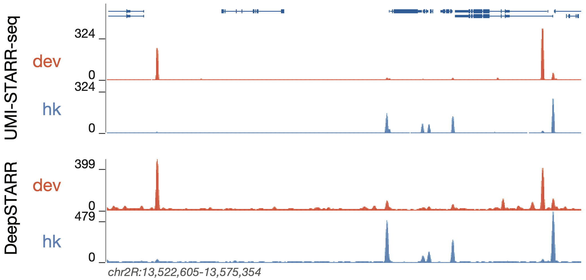
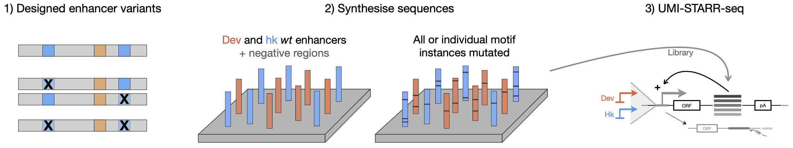

# DeepSTARR
**DeepSTARR** is a deep learning model built to quantitatively predict the activities of developmental and housekeeping enhancers from DNA sequence in *Drosophila melanogaster* S2 cells.

For more information, see the DeepSTARR publication:  
[*<ins>DeepSTARR predicts enhancer activity from DNA sequence and enables the de novo design of enhancers</ins>*](https://www.nature.com/articles/s41588-022-01048-5)  
Bernardo P. de Almeida, Franziska Reiter, Michaela Pagani, Alexander Stark. Nature Genetics, 2022.  
[Presentation at ISCB Webinar](https://www.youtube.com/watch?v=vg32mqptMdQ)

This repository contains the code used to process genome-wide and oligo UMI-STARR-seq data and train DeepSTARR.

## Genome-wide enhancer activity maps of developmental and housekeeping enhancers
We used **UMI-STARR-seq** ([Arnold et al., 2013](http://www.sciencemag.org/lookup/doi/10.1126/science.1232542); [Neumayr et al., 2019](https://doi.org/10.1002/cpmb.105)) to generate genome-wide high resolution, quantitative activity maps of developmental and housekeeping enhancers, representing the two main transcriptional programs in *Drosophila* S2 cells ([Arnold et al., 2017](http://dx.doi.org/doi:10.1038/nbt.3739); [Haberle et al., 2019](https://doi.org/10.1038/s41586-019-1210-7); [Zabidi et al., 2015](http://dx.doi.org/10.1038/nature13994)).



The raw sequencing data are available from GEO under accession number [GSE183939](https://www.ncbi.nlm.nih.gov/geo/query/acc.cgi?acc=GSE183936).  
You can find the code to process the data [here](GenomeWide_UMISTARRseq).

## DeepSTARR model

**DeepSTARR** is a multi-task convolutional neural network that maps 249 bp long DNA sequences to both their developmental and their housekeeping enhancer activities. We adapted the Basset convolutional neural network architecture ([Kelley et al., 2016](https://github.com/davek44/Basset)) and designed DeepSTARR with four convolution layers, each followed by a max-pooling layer, and two fully connected layers. The convolution layers identify local sequence features (e.g. TF motifs) and increasingly complex patterns (e.g. TF motif syntax), while the fully connected layers combine these features and patterns to predict enhancer activity separately for each enhancer type.

<p float="left" style="margin-bottom:0;margin-top:0;">
    
    
</p>

You can find the code used to train DeepSTARR and compute nucleotide contribution scores [here](DeepSTARR).    
Data used to train and evaluate the DeepSTARR model as well as the final trained model are available on zenodo at https://doi.org/10.5281/zenodo.5502060.  
DeepSTARR is also deposited in [Kipoi](http://kipoi.org/models/DeepSTARR/).  

### Predict developmental and housekeeping enhancer activity of new DNA sequences
To predict the developmental and housekeeping enhancer activity in *Drosophila melanogaster* S2 cells for new DNA sequences, please run:
```
# Clone this repository
git clone https://github.com/bernardo-de-almeida/DeepSTARR.git
cd DeepSTARR/DeepSTARR

# download the trained DeepSTARR model from zenodo (https://doi.org/10.5281/zenodo.5502060)

# create 'DeepSTARR' conda environment by running the following:
conda create --name DeepSTARR python=3.7 tensorflow=1.14.0 keras=2.2.4 # or tensorflow-gpu/keras-gpu if you are using a GPU
source activate DeepSTARR
pip install git+git://github.com/AvantiShri/shap.git@master
pip install 'h5py<3.0.0'
pip install deeplift==0.6.13.0

# Run prediction script
python DeepSTARR_pred_new_sequence.py -s Sequences_example.fa -m DeepSTARR.model
```
Where:
* -s FASTA file with input DNA sequences

## UMI-STARR-seq with designed oligo libraries to test more than 40,000 wildtype and mutant Drosophila and human enhancers

We designed and synthesised (in oligo pools by [Twist Bioscience](https://www.twistbioscience.com/resources/product-sheet/twist-oligo-pools)) wildtype and TF motif-mutant sequences of Drosophila and human enhancers. The activity of each sequence in the oligo libraries was assessed experimentally by **UMI-STARR-seq** in *Drosophila melanogaster* S2 (both developmental and housekeeping UMI-STARR-seq; see figure below) and human HCT116 cells, respectively.



The raw sequencing data are available from GEO under accession number [GSE183939](https://www.ncbi.nlm.nih.gov/geo/query/acc.cgi?acc=GSE183939).  
You can find the code to analyse *Drosophila* and human oligo UMI-STARR-seq screens [here](Oligo_UMISTARRseq).

## Code for Figures
Scripts to reproduce each main figure can be found [here](Figures) and the respective processed data [here](https://data.starklab.org/almeida/DeepSTARR/Figures_data/).

## UCSC Genome Browser tracks
Genome browser tracks showing genome-wide UMI-STARR-seq and DeepSTARR predictions in *Drosophila*, including nucleotide contribution scores for all enhancer sequences, together with the enhancers used for mutagenesis, mutated motif instances and respective log2 fold-changes in enhancer activity, are available at https://genome.ucsc.edu/s/bernardo.almeida/DeepSTARR_manuscript.  
Dynamic sequence tracks and contribution scores are also available as a [Reservoir Genome Browser session](https://resgen.io/paper-data/Almeida...%202021%20-%20DeepSTARR/views/VNZrgd8oSsCpfZfwByDlwA).

## Questions
If you have any questions/requests/comments please contact me at [bernardo.almeida94@gmail.com](mailto:bernardo.almeida94@gmail.com).
